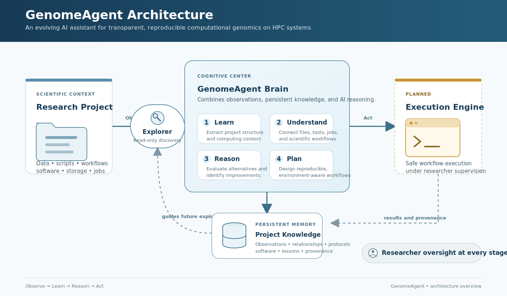

# GenomeAgent

**An AI assistant for computational genomics that continuously learns research projects, adapts to new computing environments, and uses that understanding to reason about, improve, and eventually execute computational workflows.**

GenomeAgent is an open-source framework for AI-assisted computational genomics that builds an evolving understanding of research projects through continuous learning, enabling more efficient, transparent, and reproducible computational research.

<p align="center">
  
</p>

<p align="center">
  <em>GenomeAgent continuously explores research projects, builds persistent project knowledge, reasons about computational workflows, and assists researchers with reproducible computational genomics.</em>
</p>

---

# Design Philosophy

Before an AI assistant can effectively contribute to a research project, it must first understand that project.

GenomeAgent therefore follows a simple cognitive cycle:

**Observe → Learn → Reason → Act**

Current development focuses on the first three stages while maintaining full transparency and researcher oversight.

---

# Architecture

The architecture consists of three major components.

### Explorer

The **Explorer** systematically observes research projects and their computing environments. It collects information about project structure, software, workflows, storage, and HPC resources without modifying the project.

The reusable **Task Scanner Core** extends the Explorer with focused, knowledge-guided observation of active workflows. Task profiles deterministically compare manifests, expected outputs, scheduler state and validation evidence while remaining read-only. Current profiles monitor GAM duplicate removal across the 458-sample *Fragaria vesca* graph-mapping cohort and interval-scattered GATK joint calling across the 455-sample linear-reference cohort.

The **Task State Bridge** replays those immutable observations into canonical current state, transition history, provenance and safety-gated recommendations. It keeps operational state separate from curated scientific memory and provides a trustworthy input boundary for the future Execution Engine.

The **Resource Evidence and Learning Core** records bounded Slurm accounting for explicit jobs and deterministically learns empirical runtime, peak-memory and efficiency profiles. It preserves failed attempts as censored evidence, flags cross-attempt anomalies and produces proposal-only recommendations that cannot change scheduler resources or execute jobs.

The **AI Backend Registry and Evaluation Core** versions candidate inference backends, prompts and non-sensitive benchmark suites. It prepares content-addressed run packages and scores returned model responses deterministically while keeping model download, Slurm submission, generated-code execution, external fallback and Brain knowledge promotion disabled.

The **Read-only AI Backend Evidence Collector** checks a registered backend against its actual HPC environment using one bounded SSH observation. It verifies architecture, module metadata, scheduler partition metadata, storage and a shallow model-path inventory, then rebuilds current readiness locally without downloading models, allocating a GPU or editing the registry.

The **Controlled Bounded AI Benchmark Execution Core** binds fresh backend evidence,
the verified installed-model manifest and the eight non-sensitive evaluation cases
to an expiring researcher authorization. It can submit one offline vLLM job using
one Roihu GH200 and deterministically score the returned JSONL evidence without
executing model output, training the model or activating the backend.

The **Pinned Model Acquisition Planning Core** converts that evidence into an immutable,
review-only source identity, storage and integrity plan. Unknown model revisions,
inventories, sizes and licenses remain blocking unknowns; the planner does not contact a
provider, download weights or grant execution authority.

The **Read-only Model Source Metadata Collector** resolves a registered public model's
symbolic revision to an immutable commit and records its provider inventory, byte size,
license metadata and canonical inventory digest. It performs exactly two bounded public
metadata requests and produces a review-only acquisition-specification proposal; it
does not download repository files, accept a license or update configuration.

The **Explicit Model Source and License Approval Core** converts a researcher's
review into an immutable, evidence-bound approval record. It applies only the verified
source identity and structured licence provenance to the acquisition specification;
all remote, download, scheduler, GPU, registry and activation authority remains off.

The **Controlled Model Acquisition Approval and Bundle Core** binds explicit
researcher approval to one exact current plan and prepares a content-addressed,
data-only acquisition contract. It distinguishes provider LFS SHA-256 evidence from
Git blob IDs and requires locally computed SHA-256 for every future downloaded file.
Remote access, download, submission and publication remain separately gated.

The **Read-only Model Acquisition Runtime Preflight** observes the exact prepared
bundle against Roihu immediately before execution review. It verifies the vLLM and
Hugging Face transfer runtime without contacting the provider, registers an inbound
public-model transfer context, checks fresh quota and target-path safety, and confirms
the future `gputest`/GH200 launch context. Its evidence expires after 30 minutes and
never grants download, submission, publication or activation authority.

The **Controlled Public Model Download Core** converts one unexpired preflight into a
ten-minute, researcher-issued authorization for one exact mutation: download the
approved public repository revision into the bundle's hidden staging directory. It
launches a resumable two-worker background transfer on the registered Roihu login
host, explicitly removes token variables, and records read-only status observations.
It cannot hash model files, publish the staged directory, submit Slurm, allocate a GPU
or run the model.

The **Staged Model Integrity Verification Core** first compares the downloaded
path-and-size inventory with the approved provider inventory using a bounded read-only
Roihu-CPU observation. After explicit approval it submits one serial `small` job to
compute SHA-256 for every approved regular file and compare available provider LFS
digests. Results and a manifest candidate are written only to a confined control
directory. Staging mutation, publication, GPU use and inference remain forbidden.

The **Controlled Model Publication Core** binds a fresh read-only preflight to the
successful verification result and requires explicit approval for exact transfer-cache
removal and atomic publication. Its serial CPU worker re-hashes every verified file
immediately before mutation, writes the installed manifest and performs a
non-overwriting same-filesystem directory rename. GPU use, inference, registry changes
and backend activation remain separate gates.

The **Installed Model Evidence and Controlled Backend Registration Core** binds a
fresh read-only observation of the final manifest and path-and-size inventory to the
successful integrity verification and atomic publication records. It proposes a
narrow, researcher-approved backend identity update without rereading model weights.
Registration leaves bounded GPU inference benchmarking as the only readiness gate and
does not activate or run the model.

### GenomeAgent Brain

The **GenomeAgent Brain** is the cognitive center of the system. Brain v2 promotes provenance-backed operational facts into immutable, versioned knowledge and keeps AI-derived interpretations in a separate researcher-review queue. Versioned workflow templates preserve portable workflow contracts, while the Workflow Transfer Core checks target software, environment bindings and resource gates without executing anything.

Its core functions include:

* Learn project structure
* Understand computational workflows
* Reason about analyses and alternatives
* Design improved workflows
* Adapt to new computing environments

### Execution Engine *(future)*

The future **Execution Engine** will safely perform computational analyses under researcher supervision while maintaining reproducibility and complete provenance.

---

# Current Capabilities

| Capability                  | Status                    |
| --------------------------- | ------------------------- |
| Project Exploration         | ✅                         |
| HPC Environment Discovery   | ✅                         |
| GenomeAgent Brain           | ✅                         |
| Workflow Understanding      | ✅                         |
| Read-only Task Monitoring   | ✅ Initial reusable core   |
| Operational State Bridge    | ✅ Initial reusable core   |
| Resource Evidence Learning  | ✅ Initial reusable core   |
| Brain v2 Knowledge Promotion| ✅ Initial reusable core   |
| Workflow Transfer Planning  | ✅ Initial reusable core   |
| AI Backend Evaluation       | ✅ Initial reusable core   |
| AI Backend Evidence         | ✅ Initial reusable core   |
| Model Acquisition Planning  | ✅ Initial reusable core   |
| Model Source Metadata       | ✅ Initial reusable core   |
| Model Source Approval       | ✅ Initial reusable core   |
| Acquisition Approval/Bundle | ✅ Initial reusable core   |
| Acquisition Runtime Preflight| ✅ Initial reusable core   |
| Controlled Staging Download | ✅ Initial reusable core   |
| Staged Integrity Verification| ✅ Initial reusable core   |
| Controlled Model Publication| ✅ Initial reusable core   |
| Installed Model Registration| ✅ Initial reusable core   |
| Bounded GPU AI Benchmark     | ✅ Initial reusable core   |
| Continuous Project Learning | ✅ Initial implementation  |
| AI-assisted Workflow Design | 🚧 Initial implementation |
| Safe Execution Engine       | 📋 Planned                |

---

# Task Scanner

Run the read-only GAM duplicate-removal profile from the GenomeAgent repository on the Mac:

```bash
python3 scripts/task_scan.py gam_deduplication
```

Monitor the 250 kb interval-scattered GenotypeGVCFs workflow with:

```bash
python3 scripts/task_scan.py scattered_joint_calling
```

The scanner connects through the `puhti` SSH alias and writes timestamped local reports under `workspace/task_scans/<profile>/`. It does not submit jobs or read complete GAM or VCF contents. See the [Task Scanner Core documentation](docs/task_scanner_core.md) for configuration, outputs and safety boundaries.

Ingest completed scan bundles into canonical operational knowledge with:

```bash
python3 scripts/task_state.py ingest scattered_joint_calling
python3 scripts/task_state.py ingest gam_deduplication
```

The bridge writes local state under `workspace/task_state/<profile>/` and never connects to Puhti or executes recommendations. See the [Task State Bridge documentation](docs/task_state_bridge.md).

Collect bounded read-only Slurm evidence for explicit completed or failed jobs, then rebuild deterministic resource knowledge with:

```bash
python3 scripts/task_resources.py collect scattered_joint_calling \
  --job-id 35442372_16 \
  --job-id 35452993_16 \
  --profile-key scattered_genotypegvcfs_250kb \
  --unit 35442372_16=16 \
  --unit 35452993_16=16

python3 scripts/task_resources.py ingest scattered_joint_calling
```

The collector only queries `sacct`; ingestion is entirely local. Profiles and non-executable recommendations are written under `workspace/task_resources/<profile>/`. See the [Resource Evidence and Learning Core documentation](docs/resource_evidence_and_learning_core.md).

After later Task Scanner runs, newly terminal array attempts can be discovered without entering job IDs manually:

```bash
python3 scripts/task_resources.py collect-new scattered_joint_calling --dry-run
python3 scripts/task_resources.py collect-new scattered_joint_calling
python3 scripts/task_resources.py ingest scattered_joint_calling
```

Automatic collection is capped at 20 previously unseen terminal attempts per invocation. The dry run is entirely local; collection performs only a bounded read-only `sacct` query and writes immutable local evidence.

Resource policy v1.2 aggregates widespread low-CPU behavior into cohort-level evidence, withholds scattered-joint-calling proposals until successful observations cover at least three scatter batches and three chromosomes, and isolates empirical profiles by source host. The GAM scanner expands accounting array records so completed worker elements can be discovered independently of array-parent summaries.

Build a deterministic target-environment resource decision without remote access or job execution:

```bash
python3 scripts/task_resources.py ingest scattered_joint_calling

python3 scripts/task_plan.py resources \
  scattered_joint_calling \
  --target-environment roihu
```

The planner prefers target-environment evidence, reduces cross-environment proposals to low-confidence pilot-only guidance, and explicitly withholds values when evidence is missing or blocked. Evidence availability is reported separately from allocation availability, so substantial but narrow measurements remain visible even when no transferable proposal is allowed. It writes canonical plans under `workspace/task_plans/<task>/<target_environment>/<profile_key>/`. See the [Resource Decision and Transfer Core documentation](docs/resource_decision_and_transfer_core.md).

Promote the deterministic operational artifacts into versioned Brain v2 knowledge:

```bash
python3 scripts/brain.py ingest scattered_joint_calling
python3 scripts/brain.py ingest gam_deduplication
```

Then evaluate a versioned workflow contract against a target environment:

```bash
python3 scripts/brain.py plan-workflow scattered_joint_calling \
  --target-environment roihu
```

Knowledge snapshots are content-addressed under `workspace/brain_knowledge/<task>/`. The transfer planner reports compatible, unknown and incompatible requirements separately and consumes the existing deterministic resource decision as a gate. Brain v1 AI output, when present, remains a review-required candidate and is never silently promoted. See the [Brain v2 documentation](docs/brain_knowledge_and_workflow_transfer_v2.md).

Validate the AI backend, prompt and benchmark registries with:

```bash
python3 scripts/ai_benchmark.py validate
```

Prepare an immutable, non-executable benchmark package for the planned Roihu-GPU
candidate with:

```bash
python3 scripts/ai_benchmark.py prepare \
  --backend roihu_qwen3_coder \
  --suite genomeagent_core_v1
```

This records what would need to be evaluated but does not connect to Roihu, download a
model, create a runnable Slurm script or execute inference. Returned JSONL evidence can
later be scored with `scripts/ai_benchmark.py evaluate`; even a passing suite remains
review-only. See the [AI Backend Registry and Evaluation Core documentation](docs/ai_backend_registry_and_evaluation_core.md).

After the model installation and current backend evidence are verified, prepare the
controlled GPU execution plan with:

```bash
python3 scripts/ai_benchmark_execution.py prepare \
  roihu_qwen3_coder \
  --suite genomeagent_core_v1
```

Authorization, launch, status and deterministic evaluation are separate commands;
only launch can submit one bounded GPU job. See the
[Controlled Bounded AI Benchmark Execution documentation](docs/controlled_ai_benchmark_execution.md).

Collect current read-only evidence from the registered Roihu-GPU environment and then
derive its canonical state locally:

```bash
python3 scripts/ai_backend_evidence.py collect roihu_qwen3_coder
python3 scripts/ai_backend_evidence.py ingest roihu_qwen3_coder
```

The collector uses one bounded SSH session and performs no remote writes, model
downloads, GPU allocations, Slurm submissions, recursive model scans or large-file
hashing. Evidence and current state are stored separately under
`workspace/ai_backend_evidence/` and `workspace/ai_backend_state/`. See the
[AI Backend Evidence Collector documentation](docs/ai_backend_evidence_collector.md).
On Roihu, project-quota evidence uses the versioned absolute
`csc-workspaces` path because that command is not exposed to the non-login Python
`PATH`; arbitrary path or login-shell discovery is not used during collection.

Build a deterministic, non-executable model acquisition plan from the registry and
saved backend evidence with:

```bash
python3 scripts/model_acquisition.py plan roihu_qwen3_coder
```

The **Pinned Model Acquisition Planning Core** separates source identity, storage,
integrity, approval and post-acquisition benchmark gates. It derives only a clearly
labelled parameter-byte lower bound until an immutable source revision and complete
provider inventory have been reviewed. It does not contact the model provider or
Roihu, download weights, hash large files, submit jobs, update the backend registry or
activate a model. See the
[model acquisition planning documentation](docs/pinned_model_acquisition_planner.md).

Resolve the registered public source identity and rebuild its local review state with:

```bash
python3 scripts/model_source_metadata.py collect roihu_qwen3_coder
python3 scripts/model_source_metadata.py ingest roihu_qwen3_coder
```

The collector makes one bounded symbolic-revision request and one immutable-revision
confirmation request to the registered Hugging Face repository. It records file
metadata, not file contents, and writes an acquisition-specification proposal without
applying it. License acceptance, model download, Roihu access, Slurm submission, GPU
allocation and backend activation remain disabled. See the
[model source metadata documentation](docs/model_source_metadata_collector.md).

After reviewing the exact license URL, record explicit acceptance for a specific
evidence snapshot with:

```bash
python3 scripts/model_source_metadata.py approve roihu_qwen3_coder \
  --evidence-id 20260715T094807016620Z \
  --reviewer tuomas64 \
  --accept-license Apache-2.0 \
  --confirm-license-review
```

The command is the only source-configuration mutation in this workflow. It writes an
immutable local approval record and updates the versioned acquisition specification
with the exact revision, inventory, size and licence provenance. It remains unable to
download a model or contact Roihu. See the
[model source approval documentation](docs/model_source_approval.md).

After producing and reviewing a current plan, record approval for bundle preparation
and create the still non-executable acquisition contract with:

```bash
python3 scripts/model_acquisition_control.py approve roihu_qwen3_coder \
  --plan-id <reviewed-plan-id> \
  --reviewer <researcher-id> \
  --confirm-execution-preparation

python3 scripts/model_acquisition_control.py prepare roihu_qwen3_coder \
  --plan-id <reviewed-plan-id> \
  --approval-id <approval-id>
```

These commands make no remote connection and grant no acquisition execution
authority. See the [controlled acquisition documentation](docs/controlled_model_acquisition.md).

Collect and replay a fresh read-only runtime preflight for the exact bundle with:

```bash
python3 scripts/model_acquisition_preflight.py collect roihu_qwen3_coder \
  --bundle-id <reviewed-bundle-id>
python3 scripts/model_acquisition_preflight.py ingest roihu_qwen3_coder \
  --bundle-id <reviewed-bundle-id>
```

The collector imports but never calls `snapshot_download`, performs no provider
request and expires its evidence after 30 minutes. See the
[acquisition runtime preflight documentation](docs/model_acquisition_runtime_preflight.md).

After collecting a fresh preflight, explicitly authorize and launch only the staging
download with:

```bash
python3 scripts/model_acquisition_download.py authorize roihu_qwen3_coder \
  --bundle-id <bundle-id> \
  --preflight-evidence-id <fresh-evidence-id> \
  --reviewer <researcher-id> \
  --confirm-public-model-download

python3 scripts/model_acquisition_download.py launch roihu_qwen3_coder \
  --bundle-id <bundle-id> \
  --authorization-id <authorization-id> \
  --confirm-execute-approved-download
```

Observe the background transfer without modifying it:

```bash
python3 scripts/model_acquisition_download.py status roihu_qwen3_coder \
  --bundle-id <bundle-id> \
  --authorization-id <authorization-id>
```

See the [controlled staging download documentation](docs/controlled_model_download.md).

After the download reaches `download_completed_unverified`, collect and ingest the
staged metadata inventory:

```bash
python3 scripts/model_integrity_verification.py collect roihu_qwen3_coder \
  --bundle-id <bundle-id> \
  --download-execution-id <download-execution-id>
python3 scripts/model_integrity_verification.py ingest roihu_qwen3_coder \
  --bundle-id <bundle-id>
```

Then explicitly authorize and submit the bounded CPU hash job:

```bash
python3 scripts/model_integrity_verification.py authorize roihu_qwen3_coder \
  --bundle-id <bundle-id> \
  --download-execution-id <download-execution-id> \
  --inventory-evidence-id <fresh-inventory-evidence-id> \
  --reviewer <researcher-id> \
  --confirm-staging-hash-verification

python3 scripts/model_integrity_verification.py launch roihu_qwen3_coder \
  --bundle-id <bundle-id> \
  --authorization-id <authorization-id> \
  --confirm-submit-hash-verification
```

The terminal success state is `verified_ready_for_publication_review`; it does not
publish the model. See the
[integrity verification documentation](docs/model_integrity_verification.md).

After successful verification, collect and ingest a fresh publication preflight:

```bash
python3 scripts/model_publication.py collect roihu_qwen3_coder \
  --bundle-id <bundle-id> \
  --verification-id <verification-id>
python3 scripts/model_publication.py ingest roihu_qwen3_coder \
  --bundle-id <bundle-id>
```

Publication requires explicit confirmation of both the atomic rename and removal of
the exact transfer cache:

```bash
python3 scripts/model_publication.py authorize roihu_qwen3_coder \
  --bundle-id <bundle-id> \
  --verification-id <verification-id> \
  --publication-evidence-id <fresh-evidence-id> \
  --reviewer <researcher-id> \
  --confirm-atomic-model-publication \
  --confirm-remove-download-cache

python3 scripts/model_publication.py launch roihu_qwen3_coder \
  --bundle-id <bundle-id> \
  --authorization-id <authorization-id> \
  --confirm-submit-model-publication
```

The successful state `published_ready_for_installed_model_evidence` confirms the
non-overwriting same-filesystem publication but does not activate or run the model.
See the [controlled publication documentation](docs/controlled_model_publication.md).

Bind the final installed manifest to its verification and publication provenance,
then derive a review-only registry proposal:

```bash
python3 scripts/model_registration.py collect roihu_qwen3_coder \
  --bundle-id <bundle-id> \
  --publication-id <publication-id>

python3 scripts/model_registration.py ingest roihu_qwen3_coder
```

After reviewing the proposal, apply only the verified model identity fields:

```bash
python3 scripts/model_registration.py approve roihu_qwen3_coder \
  --evidence-id <installed-model-evidence-id> \
  --reviewer <researcher-id> \
  --confirm-register-verified-installation
```

The approval does not submit a GPU job or activate the backend. A fresh backend
observation must then confirm the registered manifest digest; bounded inference
benchmarking remains mandatory. See the
[installed-model registration documentation](docs/installed_model_registration.md).

---

# Why GenomeAgent?

| Typical AI assistant                    | GenomeAgent                                                |
| --------------------------------------- | ---------------------------------------------------------- |
| Relies on user-provided context         | Systematically explores research projects                  |
| Starts each interaction from scratch    | Continuously learns complete research projects             |
| Limited project context                 | Builds persistent project knowledge                        |
| Assumes a generic computing environment | Learns and adapts to the local HPC environment             |
| Generates isolated code                 | Understands, improves, and designs computational workflows |

---

# Adaptation

Research projects often outlive the computing environments in which they begin.

GenomeAgent is designed to preserve its understanding of a research project while continuously learning new HPC environments as software, storage systems, and computing infrastructure evolve.

---

# Vision

GenomeAgent aims to become an AI research companion that develops an increasingly deep understanding of computational genomics projects through continuous learning and adaptive reasoning, enabling more effective, transparent, and reproducible computational research.

Although GenomeAgent is currently developed and validated for computational genomics, its underlying architecture is designed to be extensible to other HPC-based scientific domains.
